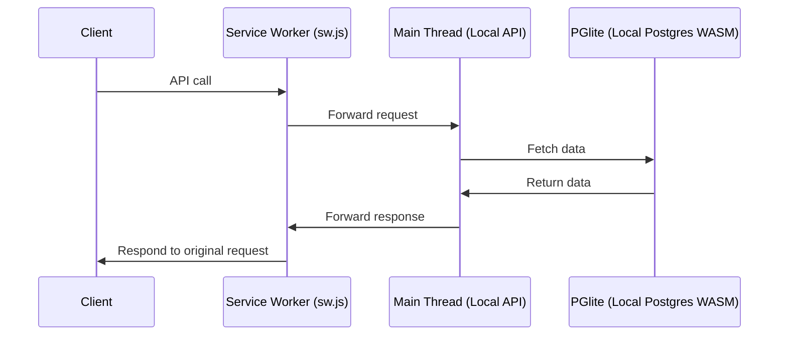

# trytanstackdb.com _(ALPHA version)_

> Note that this project is still in its early stages.

An interactive guide for taking the first steps with
[`@tanstack/tanstack-db`](https://tanstack.com/db/latest/docs/overview) by
[fuko](fulop.dev/).

[🔗 trytanstackdb.com](https://trytanstackdb.com)

https://github.com/user-attachments/assets/32efe3de-f976-4009-9970-40605f1f1b51

## TODO

See [TODO.md](./TODO.md).

## 🚀 Main goals, motivations

It took a while for TanStack DB to "click" for me, but it's not because this
library is too nieche. When I used it for a POC and showed that to my
colleagues, they seemed to immediately understand the advantages of TanStack DB,
because I could show exactly the things I explained.

This project aims to bring the same interactive and practical learning
experience to everybody elseon the internet.

### Target audience

There are two types of people in the target audience of this project:

1. Devs, who just heard about TanStack DB, and want to understand what it is,
   and see if it could be useful for their use cases.
2. _(Future goal):_ People who want to build things with TanStack DB, and want
   to see a reference implementation of the features it has.

## Architecture

The architecture was designed around the two things that I wanted to highlight
in the interactive tutorial:

1. TanStack DB can make applications feel incredibly fast, even when the network
   latency is large
2. contrary to conventional local-first approaches, this library doesn't require
   big technical changes on the back end (works with any database, no need for
   adding new libs to your backend, simple api endpoints work just fine)

Databases are expensive, so instead of running one on a server, this app uses a
local Postgres instance in WASM via [PGlite](https://pglite.dev/).

I wanted to make it possible to inspect `fetch` requests in the browser to make
the syncing mechanisms more observable. That is achieved by a service worker
that proxies http requests between front end and the API handlers (which are
also part of the front end).

## Development

See [DEVELOPMENT.md](./DEVELOPMENT.md).
