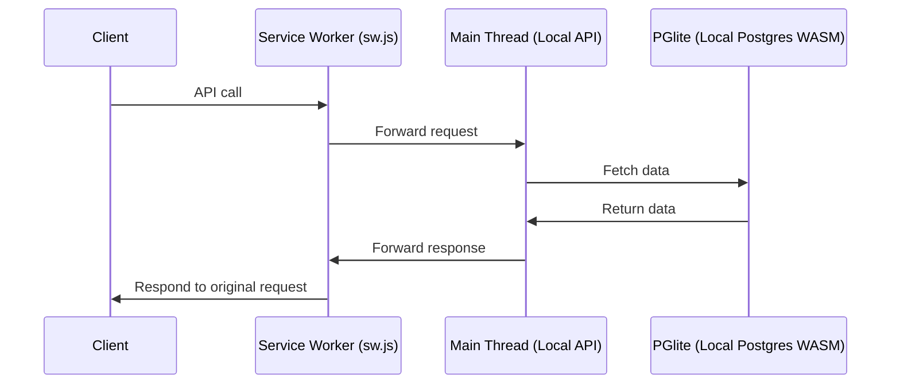

# trytanstackdb.com _(ALPHA version)_

> Note that this project is still in its early stages.

An interactive guide for taking the first steps with
[`@tanstack/tanstack-db`](https://tanstack.com/db/latest/docs/overview) by
[fuko](fulop.dev/).

[trytanstackdb.com](https://trytanstackdb.com)

## 🚀 Main goals, motivations

There are two types of people in the target audience of this project:

1. Devs, who just heard about TanStack DB, and want to understand what it is,
   and see if it could be useful for their use cases.
2. _(Future goal):_ People who want to build things with TanStack DB, and want
   to see a reference implementation of the features it has.

## Architecture

There are two problems that make it hard to show the main strengths of TanStack
DB:

1. it can make applications feel incredibly fast
   - but that is hard to show without the network latency (everything is fast
     locally)
2. contrary to conventional local-first approaches, it doesn't require big
   technical changes on the back end (works with any DB, no need for adding new
   libs to your backend, simple api endpoints work just fine)
   - can't simulate the db in stackblitz examples

Databases are expensive, so instead of running one on a server this app uses a
local Postgres instance in WASM via [PGlite](https://pglite.dev/).

For educational purposes, I had to make it possible to inspect `fetch` requests
in the browser. That is achieved by a service worker that proxies http requests
between front end and the API handlers (which are also part of the front end).

## Development

See [DEVELOPMENT.md](./DEVELOPMENT.md).
